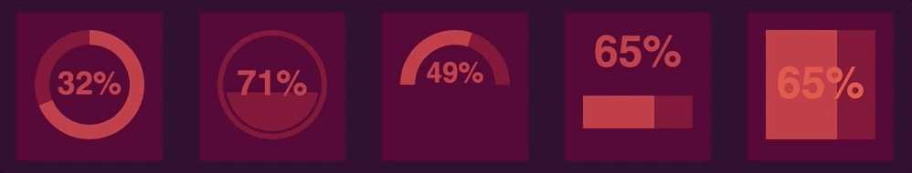

<div align="center">
    <h2>React SVG Meters</h2>
    <p align="center">
        <p>Simple and stylish meters built with SVG for React projects with zero dependencies.</p>
        <a href="https://royledford.github.io/react-svg-meters">
            <b>View the documentation »</b>
        </a>
    </p>
</div>

## Installation

Install via npm:

```bash
$ npm install react-svg-meters --save
```

or

```bash
$ yarn add react-svg-meters
```

## Usage

Here is quick example to get you started!

```js
import React from 'react'
import { render } from 'react-dom'
import { CircleMeter } from 'react-svg-meters'

function App() {
  return <CircleMeter value={23} size={150} />
}

render(<App />, document.querySelector('#app'))
```

## Built With

* [React](https://reactjs.org/) - The library used to built the meters.
* [Styleguidist](https://react-styleguidist.js.org/) - Used to create the documentation.
* [Jest](https://facebook.github.io/jest/) and [Enzyme](https://github.com/airbnb/enzyme) - For testing utils.

### svg

Why use Svg? It is [supported](http://caniuse.com/#search=svg) by all major browsers.

### License

This repository has been released under the [MIT License](LICENSE)

### Acknowledgments

Just a shout out to all the various things that helped maked this library

* Facebook for [react](https://reactjs.org/) and [create-react-app](https://github.com/facebookincubator/create-react-app)
* The folks at [React Styleguidist](https://react-styleguidist.js.org/) for providing a tool to build the documentation for library
* All the authors, coders, and friends who inspired me to release an open source project.
